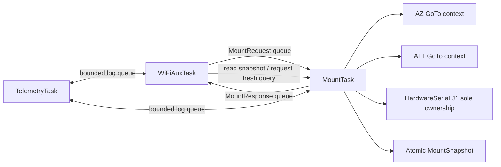

# Standalone ESP32 port: architecture audit

## Scope and status

This document defines the port of the proven PC reference implementation to an
ESP32 Arduino-compatible firmware. It is design-only: no ESP32 production
firmware, COM access or motor movement was added in this milestone.

Target path:

```text
SkyPortal / SkySafari
        |
ESP32 HBG3-compatible Wi-Fi/TCP frontend
        |
AUX semantic dispatcher
        |
MountController-equivalent
        |
NXW436 backend / staged GoTo
        |
single-owner J1 UART task, 4800 8N1
        |
NXW436 Rev A
```

Python is the behavioral parity oracle for already classified project
semantics; it is not independent hardware, electrical or client-protocol
evidence. ESP32 code must match observable validated semantics and preserve the
underlying evidence labels; it must not reinterpret values or retune the
controller during porting.

## Evidence classes used here

| Class | Meaning |
| --- | --- |
| `EXACT_BOARD` | physical measurement or successful experiment on this NXW436 |
| `SKYPORTAL_CAPTURE` | real phone-client RX/TX capture against this project |
| `HBG3_SOURCE` | pinned HBG3 implementation behavior |
| `PYTHON_REFERENCE` | tested current PC implementation, backed by the classes above where applicable |
| `DESIGN_CONSTRAINT` | accepted design for the ESP32 port, not yet hardware-validated |
| `UNKNOWN` | must not be silently implemented as fact |

## Python -> ESP32 component mapping

| Python reference | ESP32 component | Port rule | Evidence |
| --- | --- | --- | --- |
| `mount_model.py` | `domain/PositionMath` | `constexpr uint32_t kPositionModulus=0x102A00`; exact signed modular delta | `EXACT_BOARD`, `PYTHON_REFERENCE` |
| `mount_api.py` | `mount/MountTypes`, `mount/IMountBackend`, `mount/MountController` | keep `Axis`, `Direction`, named speed tiers, rich `GotoResult`/status | `PYTHON_REFERENCE` |
| `nxw436_driver.py` | `nxw436/Nxw436Protocol`, `nxw436/Nxw436UartOwner` | exact opcodes, 3-byte BE RX, transaction timeout, same-prefix double STOP | `EXACT_BOARD` |
| `nxw436_mount_backend.py` | `nxw436/Nxw436Backend` | explicit discrete manual mapping; no AUX/network knowledge | `EXACT_BOARD`, `PYTHON_REFERENCE` |
| `nxw436_position_controller.py` | `motion/RelativeGotoAxisMachine` | nonblocking/tick port of frozen state machine, not a new controller | `EXACT_BOARD`, `PYTHON_REFERENCE` |
| `celestron_aux/messages.py` | `celestron_aux/AuxMessages` | fixed command/address constants and payload contracts | `SKYPORTAL_CAPTURE`, `HBG3_SOURCE` |
| `celestron_aux/framing.py` | `celestron_aux/AuxCodec` | `0x3B`, length, additive-zero checksum | `HBG3_SOURCE`, independent references, captures |
| `celestron_aux/parser.py` | `celestron_aux/AuxStreamParser` | stateful stream parser; fragmentation/coalescing/resync | `PYTHON_REFERENCE`, `HBG3_SOURCE` |
| `celestron_aux/coordinates.py` | `celestron_aux/AuxCoordinateAdapter` | integer-only bidirectional 24-bit transform; sole conversion owner | `PYTHON_REFERENCE`, hardware captures |
| `celestron_aux/virtual_mc.py` | `celestron_aux/VirtualMotorControllers` | per-axis config/manual ownership, startup-idempotent STOP | `SKYPORTAL_CAPTURE`, `PYTHON_REFERENCE` |
| `celestron_aux/dispatcher.py` | `celestron_aux/AuxSemanticDispatcher` | table/gated semantic requests; no J1 bytes | `SKYPORTAL_CAPTURE`, `PYTHON_REFERENCE` |
| `celestron_aux/goto_coordinator.py` | `motion/GoToCoordinator` | independent axis jobs and cancellation; no threads required in port | `SKYPORTAL_CAPTURE`, `PYTHON_REFERENCE` |
| `celestron_aux/tcp_server.py` | `net/AuxTcpServer` | one client, parser per connection, binary RX/TX, bounded buffers | `HBG3_SOURCE`, captures |
| `hbg3_infrastructure_experiment.py` / decomposition | `net/WifiFrontend`, `net/Hbg3Advertisement` | Direct Connect + station mode; port 2000; UDP 55555 advertisement | `HBG3_SOURCE`, `SKYPORTAL_CAPTURE` |

## Frozen NXW436 behavior to port 1:1

### Wire protocol

```text
AZ position 01
AZ+ 06 pppppp
AZ- 07 pppppp
ALT position 15
ALT+ 1A pppppp
ALT- 1B pppppp
STOP = same active prefix + 000000, sent twice with existing interval
```

UART is `4800 8N1`; position is 24-bit big-endian modulo `0x102A00`.
Evidence: exact-board measurement and direct USB-TTL experiments in
`research/NXW436.md`.

### Manual policy

```text
AUX 02 -> MANUAL_CONSERVATIVE -> 0000F5
AUX 05 -> FINE                -> 003978
AUX 07 -> MEDIUM              -> 0072F1
AUX 09 -> MANUAL_HIGH         -> 00E5E3
```

All are discrete mappings with exact-board evidence. Unlisted rates reject
without UART movement or success ACK. No formulas/interpolation.

### Relative GoTo

Preserve:

- stages `FAST -> MEDIUM -> FINE -> SLOW -> STOP -> SETTLE -> RESULT`;
- current AZ/ALT payload tables and thresholds;
- AZ stop margin `200`, ALT `350`;
- wrap-aware arithmetic;
- RX length/range validation;
- pending/confirmed reverse-sample logic;
- AZ MEDIUM `1.5 s / 20 counts` no-progress evidence;
- one same-payload `0072F1` resend and bounded `2.0 s` recovery;
- same-prefix double STOP;
- `GotoResult.completed != target_acquired`;
- absolute target recomputed from post-pre-STOP initial sample.

No startup kick remains. The MEDIUM resend is recovery after confirmed motion,
not start assist.

## ESP32 source tree

Recommended PlatformIO + Arduino framework layout:

```text
firmware/esp32_nxw436/
  platformio.ini
  src/
    main.cpp
    app/AppComposition.cpp
    config/FirmwareConfig.cpp
    domain/PositionMath.cpp
    mount/MountController.cpp
    nxw436/Nxw436Protocol.cpp
    nxw436/Nxw436UartOwner.cpp
    nxw436/Nxw436Backend.cpp
    motion/RelativeGotoAxisMachine.cpp
    motion/GoToCoordinator.cpp
    celestron_aux/AuxCodec.cpp
    celestron_aux/AuxStreamParser.cpp
    celestron_aux/AuxCoordinateAdapter.cpp
    celestron_aux/VirtualMotorControllers.cpp
    celestron_aux/AuxSemanticDispatcher.cpp
    net/WifiFrontend.cpp
    net/Hbg3Advertisement.cpp
    net/AuxTcpServer.cpp
    telemetry/Telemetry.cpp
  include/                      # corresponding headers
  test/native/                  # host Unity tests
  test/embedded/                # ESP32 loopback/integration tests
```

Avoid directory name `aux` on Windows; use `celestron_aux`.

## FreeRTOS concurrency model

### Chosen model: one UART/motion owner



`MountTask` is the sole owner of:

- J1 `HardwareSerial`;
- backend remembered direction;
- manual ownership;
- two axis GoTo state machines;
- physical STOP execution;
- fresh encoder transactions.

This makes UART interleaving structurally impossible but does not prove RX
freshness after a partial timeout. No TCP callback and no timer callback may
touch UART. A separate `UartTask` is unnecessary in the first implementation
because `MountTask` already serializes every transaction.

### Tasks

| Task | Responsibility | Must not do |
| --- | --- | --- |
| `WiFiAuxTask` | Wi-Fi lifecycle, UDP advertisement, one TCP client, AUX stream parsing/serialization, local replies, semantic request enqueue | block on GoTo; touch UART; own motor state |
| `MountTask` | dequeue semantic requests, execute one short UART transaction, tick both axis controllers, ownership/cancellation, update snapshots | network I/O; long sleeps; alignment/astronomy |
| `TelemetryTask` (optional first milestone) | drain bounded log ring to USB serial | issue mount/network operations |

ESP32 Wi-Fi/Arduino internal tasks remain framework-owned and are outside mount
state ownership.

### Message contract

Fixed-size queues, no unbounded heap allocation in steady state:

```text
MountRequest {
  connection_epoch, request_id, kind, axis, source, destination,
  payload[3], target_native, goto_variant
}

MountResponse {
  connection_epoch, request_id, status, reply_payload[4], reply_len,
  position_raw, job_state, failure_code
}
```

Local frontend replies (`GET_VER`, model/config compatibility values) do not
enter `MountTask`. Position, move, STOP, GoTo, cancellation and status do.

`WiFiAuxTask` never blocks waiting for queue space. Queue policy is explicit:

- ordinary query/config queue full: log/reject, no fabricated response;
- GoTo/manual MOVE queue full: reject before physical ownership, no ACK;
- STOP/cancel: set a per-axis atomic safety request and use a reserved
  high-priority queue; ACK only after a matching current-epoch response confirms
  the physical action;
- every reconnect increments `connection_epoch`;
- responses whose epoch no longer matches the active connection are discarded;
- request IDs are unique within an epoch and fixed-width wrap is tested.

### Scheduling both axes

There is one `AxisGotoContext` per AZ/ALT. `MountTask` runs each as a
nonblocking tick state machine. When a sample deadline is due, it executes one
atomic query then returns to the scheduler. Long waits in Python become stored
deadlines (`millis()`/`esp_timer_get_time()`), never `delay()` in the motion
state machine.

AZ/ALT are concurrent semantically, but J1 transactions remain sequential:

```text
tick AZ -> query 01/read3
handle queued network request
tick ALT -> query 15/read3
tick AZ -> possible MOVE
...
```

The full same-prefix double STOP remains one MountTask operation; no other UART
request may run between its two writes.

### Frozen timing parity contract

The tick port is not parity-complete merely because it uses the same state
names. It preserves this Python ordering/timing contract:

```text
pre-STOP -> 0.25 s -> initial read
nominal sample interval = 0.15 s
AZ no-progress window = 1.5 s / <20 counts
AZ same-MEDIUM recovery window = 2.0 s
configured maximum-duration and settle deadlines
```

Use a monotonic 64-bit microsecond timebase with wrap-safe deadline comparison.
Initial scheduling target is no more than `25 ms` lateness beyond a due 150-ms
motion sample; this is a `DESIGN_CONSTRAINT` to measure, not a proven fact.
STOP/cancel has highest priority; an overdue motion sample precedes ordinary
position/config requests.

Golden transition traces must match Python for pre-STOP/read, thresholds,
timeout, pending/confirmed reverse samples, AZ recovery and settle under queue
load. Do not claim a 1:1 controller port until these traces and timing budgets
pass.

## Motion ownership and cancellation

Per-axis internal states match the accepted Python coordinator:

```text
IDLE
RECOVERY_UNKNOWN_AFTER_RESET
GOTO_ACTIVE
STOPPING
COMPLETED
FAILED
CANCELLED
```

Manual state remains explicit in `VirtualMotorControllers` (`FRONTEND_IDLE` vs
owned direction). Policies to port:

- second active-axis GoTo rejects; no queue/replace;
- manual `0x24/0x25` during GoTo requests cancellation first;
- cancellation is cooperative at bounded controller checkpoints;
- controller performs the physical STOP; frontend does not race another STOP;
- manual movement starts only after ownership release;
- normal in-session startup `0x24/00` in proven `FRONTEND_IDLE` sends zero UART
  bytes and ACKs;
- owned `0x24/00` uses remembered actual direction and ACKs only after double
  STOP success;
- TCP disconnect does not currently cancel physical GoTo automatically;
- no async task deletion/exception injection.

After ESP32 brownout/reset while NXW436 remains powered, process-local ownership
is lost. Each axis starts in `RECOVERY_UNKNOWN_AFTER_RESET`, not
`FRONTEND_IDLE`. Movement is forbidden and `0x24/00` is not ACKed as proof of
physical stop: direction is unknown and no UART STOP is guessed. Two equal
position reads do not prove absence of movement.

Leaving recovery requires a separately reviewed operator-approved procedure,
such as a confirmed joint mount/bridge power cycle or explicit physical
stationary recovery workflow. Persisting an old direction in NVS is not proof.

`MC_SLEW_DONE` projection:

```text
GOTO_ACTIVE -> 00
COMPLETED   -> FF
FAILED/CANCELLED with proved successful physical STOP -> FF on wire,
  while rich internal state/error remains FAILED/CANCELLED
unsafe/unknown terminal state -> no fabricated success
```

Evidence: HBG3 v9.11 source plus real SkyPortal fake/hardware captures documented
in `research/SKYPORTAL_GOTO_SLEW_RESEARCH.md`.

## HBG3-compatible network frontend

Port from pinned HBG3 v3.8 behavior and accepted PC captures:

- Direct Connect: real SkyPortal UI requires SoftAP prefix `Celestron-`; use
  `Celestron-<last 3 MAC bytes>` at `1.2.3.4/28`. Keep HBG3 `AMW007` marker in
  advertisement payload; `HomeBrew-*` alone was rejected before TCP connect;
- station/infrastructure: DHCP by default, optional static config in NVS;
- TCP server `2000`, one active client, reconnect after disconnect;
- binary AUX stream, not one-read/one-frame;
- UDP advertisement to port `55555` about once per second while no client;
- advertisement JSON contains actual ESP32 MAC and `AMW007` version marker;
- TCP keepalive and 15-second inbound-byte idle policy, subject to ESP32 core
  API parity testing;
- no management port `3000` in first milestone unless needed for provisioning.

Discovery destination IP/source port remain an implementation/API detail to
verify with ESP32 packet capture; HBG3 source calls `broadcastTo()` but does not
hard-code the destination address in the application source.

## AUX behavior to port

### Source/client-confirmed

- framing/checksum and addresses `0x20`, `0x10`, `0x11`;
- startup identity/config replies currently accepted by real SkyPortal;
- per-axis `GET_POSITION` with 3-byte AUX coordinate;
- manual `MOVE_POS/NEG`, rate-zero STOP and ACK behavior;
- four explicit manual rates;
- `GOTO_FAST` and `GOTO_SLOW`, 3-byte targets, empty ACK;
- per-axis `SLEW_DONE`: active `00`, done `FF`;
- FAST AZ/ALT -> SLOW AZ/ALT client sequence;
- GoTo cancellation: `0x24/00` to AZ and ALT.

### Excluded

- real alignment engine;
- tracking/guide-rate motion;
- GPS service;
- backlash compensation;
- unsupported AUX rates/commands;
- physical wireless hand controller.

## Coordinate adapter port

Port integer behavior exactly:

- AUX full turn `2^24`;
- native modulus injected by backend (`0x102A00` for NXW436);
- explicit native zero, AUX zero and sign per axis;
- round-to-nearest signed integer matching Python `_round_div`;
- shortest signed AUX delta in `fromAux()`;
- optional non-wrapping limits, but do not invent ALT limits;
- no duplicate scaling in dispatcher/backend.

Session reference can be zero or explicitly seeded AZ/ALT degrees. It remains
session-local relative calibration, not celestial alignment.

## Safety model

- no movement before successful UART initialization and valid reads of both
  axis positions;
- no guessed direction and no both-prefix STOP;
- startup-idempotent STOP emits no UART only after this boot session has entered
  proven `FRONTEND_IDLE`; `RECOVERY_UNKNOWN_AFTER_RESET` does not ACK it;
- post-STOP position sampling is best-effort and never suppresses a successful
  STOP ACK;
- malformed/timeout position never becomes a synthetic position;
- unsupported rate/command produces no movement and no false ACK;
- bounded GoTo target delta remains required until celestial calibration is
  solved;
- J1 and Wi-Fi watchdog/disconnect motion policy is **not defined by current
  evidence** and must receive separate safety review before firmware release.
- a partial UART timeout enters `UART_DESYNC`; serialized ownership alone does
  not prove the next bytes are fresh. Movement remains blocked until a reviewed
  resynchronization procedure succeeds.

## Proposed migration order

### Milestone 1: host-buildable semantic core, no hardware

1. Create PlatformIO Arduino project and native Unity tests.
2. Port `PositionMath`, `AuxFrame/AuxCodec`, stream parser and coordinate adapter.
3. Port command constants/profile tables and local startup replies.
4. Port `MountTypes` and a deterministic `FakeMountBackend`.
5. Run captured SkyPortal transcripts through host tests and compare exact TX.

Deliverable: C++ semantic core produces byte-identical replies to Python for
recorded startup/manual/GoTo captures. No ESP32 Wi-Fi or J1 movement yet.

### Milestone 2: ESP32 fake mount frontend

1. Add Wi-Fi Direct Connect first, then station mode.
2. UDP advertisement and TCP AUX server.
3. Run real SkyPortal against ESP32 fake mount.
4. Validate startup, manual simulation, FAST/SLOW GoTo, SLEW_DONE and cancel.

### Milestone 3: read-only J1

1. Assemble level shifting/power from `ESP32_NXW436_INTERFACE.md`.
2. `MountTask` owns UART; only `01`/`15` reads enabled.
3. Compare raw frames and wrap against USB-TTL golden evidence.

### Milestone 4: controlled manual hardware

Enable `0000F5` first, then the existing explicit mapping table, preserving
same-prefix double STOP and no unsupported rates.

### Milestone 5: staged GoTo

Port the controller state machine and coordinator only after read/manual parity.
Use small explicit delta bounds and compare transition traces against Python.

## Parity-test strategy

### Golden vectors from Python

Export stable fixtures, not Python implementation details:

- AUX valid/invalid frames and checksums;
- fragmented/coalesced stream chunks and expected parser events;
- coordinate transforms at zero, half-turn, wrap and signed boundaries;
- manual mapping and exact NXW436 TX bytes;
- startup response transcripts;
- fake FAST/SLOW/SLEW_DONE/cancel transcripts;
- controller stage-transition traces and failure classifications;
- double STOP TX sequence.

### Native C++ tests

PlatformIO `native` + Unity tests consume the same fixture files. Exact bytes,
integer values and state transitions must match Python. Floating-point must not
enter protocol/position math.

### Transcript replay

Feed captured `tcp_raw.bin` or derived immutable frame fixtures into the C++
parser/dispatcher and compare generated AUX TX to `aux_tx_frames.jsonl` golden
bytes. Captures are evidence inputs; synthetic/profile metadata must remain
distinguishable from device-captured behavior.

### UART fake

A fake `INxw436Uart` records TX and supplies scripted RX/timeout/malformed
frames. Tests prove transaction ownership, no interleaving, exact double STOP,
cancel/failure behavior and two-axis scheduling.

### Hardware-in-loop (later)

Read-only `01/15` first, then one explicit manual payload at a time. No motor
command is part of normal CI.

## Behavior needing clarification before a safe port

1. **Session calibration persistence:** Python receives CLI signs/zero seeds;
   ESP32 needs a reviewed NVS/provisioning model. No permanent pointing model is
   established.
2. **Network-loss safety:** current evidence says disconnect does not
   automatically cancel GoTo. A standalone wireless device needs an explicit
   safety decision; do not silently add a watchdog STOP.
3. **ALT mechanical limits:** no proven non-wrapping range; do not invent one.
4. **HBG3 frame-size policy:** v3.8 accepted a small fixed packet range, Python
   allows AUX length up to 255. First C++ core should support the Python bound
   with a fixed `258`-byte buffer unless memory review chooses a documented
   stricter bound.
5. **`MC_GOTO_SLOW` references:** one independent metadata table says 2-byte
   payload, but real SkyPortal captures use 3 bytes. Port the captured 3-byte
   contract for this client and retain the conflict in documentation.
6. **Terminal GoTo projection:** safely stopped failure maps to wire `FF` while
   internal state remains FAILED. ESP32 must preserve both facts.
7. **Synthetic compatibility replies:** version/model/max-rate/backlash/
   approach values were accepted by SkyPortal but are not all real motor-device
   captures. Keep their evidence labels in code comments/tests.
8. **UART freshness:** J1 responses lack transaction IDs. The sole-owner task
   prevents interleaving but does not independently prove freshness; retain
   timeout/range/reverse validation.
9. **Telemetry persistence:** ESP32 cannot mirror unbounded PC JSONL/CSV. Define
   bounded ring/log export without weakening runtime safety.
10. **Partial UART timeout recovery:** sole ownership prevents response stealing
    but not stale bytes. Quarantine/resync/drain policy needs separate
    fault-injection and Python-parity review before read-only J1 enablement.

## Stale/conflicting research statements

Do not delete these historical statements yet; future agents must interpret
them using chronology:

- `AGENTS.md` Current phase says network research/PC fake frontend is next and
  says not to touch ESP32/hardware; later evidence and this user-authorized task
  supersede that phase statement. Its hardware/safety invariants remain valid.
- `AGENTS.md` and `KILO_HANDOFF.md` mention old test baselines (`42`, `98`),
  while the current suite is larger.
- `MOUNT_CONTROL_ARCHITECTURE.md` says Fake GoTo is immediate and that network/
  ESP32 are outside scope; optional gated fake GoTo and PC frontend now exist.
- `HBG3_FRONTEND_DECOMPOSITION.md` says ESP32 work is excluded and its PC
  comparison says discovery/listener are missing; those were milestone-local.
- `AUX_NXW436_TRANSLATION.md` top table still marks SLEW_DONE and GoTo gated or
  unsupported, while later chronological sections document fake and hardware
  implementation/captures.
- `AUX_NXW436_TRANSLATION.md` describes fake coordinate modulus `256`; the
  experiment was later corrected to use the backend canonical modulus.
- `SKYPORTAL_GOTO_SLEW_RESEARCH.md` begins as design-only and contains early
  UNKNOWN/disabled statements; later sections document implementation, client
  captures, hardware runs and fixes.
- `KILO_HANDOFF.md` contains chronological statements that hardware GoTo had
  not run and later statements that it did. Read it as a timeline, not a single
  current-state block.
- `nxw436_driver.py` comments say only external rate labels 1/8 were measured;
  later exact-board work validates the explicit four-payload manual policy in
  `nxw436_mount_backend.py` and research chronology.
- `KILO_HANDOFF.md` historical “Do not do yet” section still forbids `0x09`,
  but later current four-quadrant exact-board evidence authorizes
  `AUX 09 -> MANUAL_HIGH -> 00E5E3`; its other milestone-local prohibitions
  require independent chronological interpretation.
- `research/NXW436_ESP32_INTERFACE.md` is an earlier interface proposal. Its
  permanently enabled HCT OE and J1-6 power topology conflict with the current
  fail-safe-disabled OE and separate-buck constraints. Preserve it as history;
  use `ESP32_NXW436_INTERFACE.md` for this port review.

## First implementation milestone proposed for review

Build only `firmware/esp32_nxw436` semantic core and native tests:

```text
PositionMath
MountTypes / IMountBackend
AuxFrame / AuxCodec / AuxStreamParser
AuxCoordinateAdapter
VirtualMotorControllers configuration state
recorded startup local replies
FakeMountBackend
transcript replay test harness
```

No Wi-Fi socket, no J1 UART and no motor command in this first milestone. The
acceptance criterion is byte-for-byte parity with selected Python golden
fixtures and captured SkyPortal transcripts. FreeRTOS/Wi-Fi/J1 integration
starts only after architecture review of this document.

## Milestone 1 implementation result

Implemented under `firmware/esp32_nxw436` as a PlatformIO `native` project:

- `PositionMath`, mount types/interface and deterministic fake backend;
- AUX frame/checksum codec and stream parser;
- bidirectional integer coordinate adapter;
- virtual MC configuration and semantic core;
- Python golden exporter;
- normalized startup/manual, GoTo/SLEW_DONE and cancellation transcripts;
- native Unity parity tests.

The implementation has no Wi-Fi, socket, FreeRTOS, ESP32 or UART dependency.
Native source audit contains no `WiFi`, `HardwareSerial`, `FreeRTOS`, COM-port
or socket usage. Build uses C++17 with warnings as errors.

Known Milestone-1 differences/limitations, not hidden as parity:

- parser buffer is fixed/bounded and reports overflow as `PayloadTooLarge`,
  while Python diagnostics use a distinct buffer-limit text label;
- parser test result collection uses host `std::vector`; embedded queue/batch
  storage remains Milestone 2 work;
- fake GoTo completion is an explicit test directive, not a timing scheduler;
- rich real-controller failure/result fields are represented only by the host
  types needed by current fixtures;
- transcript timestamps, peer/session IDs and environment-dependent positions
  are normalized as documented in fixture provenance;
- synthetic identity/model/config replies remain labeled compatibility values,
  not physical NXW436 capability evidence.

## Milestone 2 implementation status

Automated implementation is complete under the same PlatformIO project:

- Arduino `esp32dev` target;
- Direct Connect SoftAP `Celestron-<MAC>` at `1.2.3.4/28`;
- exact bounded HBG3 advertisement payload to UDP port `55555`;
- one-client TCP AUX server on port `2000`;
- real client lifecycle follows HBG/PC reference: ESP32 сохраняет socket до
  FIN/reset либо общего 15-second RX idle timeout; AUX frame не является
  connection boundary and fragmented/coalesced input остаётся в одном stream;
- parser reset and incrementing `connection_epoch` per client;
- fixed 128-byte network RX buffer and fixed 32-event parser batch;
- stale epoch response guard;
- bounded AUX frame diagnostic output;
- C++ `SemanticCore` with deterministic fake manual movement;
- nonblocking 6-second per-axis fake GoTo progression;
- FAST/SLOW ACK, position polling, SLEW_DONE `00/FF` and cancellation.

The embedded network path calls `feedBounded()` and does not use host
`std::vector`. It uses the cooperative Arduino loop and no request queue in this
fake-only milestone: semantic dispatch is bounded and nonblocking, and fake
progress is tick-driven. The future `MountTask`/queues remain Milestone 3 design
for J1 ownership.

Automated status:

```text
PlatformIO native clean build: PASS
native Unity tests: 14 PASS
repeated native run: PASS
Python reference suite: 117 PASS
golden generation deterministic: PASS
ESP32 esp32dev build: PASS
RAM 46224 / 327680 bytes (14.1%)
Flash 766057 / 1310720 bytes (58.4%)
```

Milestone 2 is not fully accepted until a real phone connects directly to the
ESP32 and validates startup, polling, manual fake movement, FAST/SLOW GoTo,
SLEW_DONE, cancellation and reconnect. No J1 hardware is involved.

### Milestone 2 real-client acceptance

The user confirmed a real SkyPortal -> ESP32 fake-mount session reached
Telescope Controls, manual fake movement, changing crosshair/position and
startup sequence without reset. `AzmAltOnly` was selected as active runtime
profile after optional B4/B9/12 facade triggered focus/StarSense follow-up
surfaces. This is `M2_REAL_SKYPORTAL_ACCEPTED` for startup/manual semantic
path; long-duration transport stability remains a separate observation rather
than an implied guarantee. No J1 hardware was connected.

## Milestone 3 implementation: read-only J1

Implemented but not flashed/connected:

```text
nxw436::j1::INxw436ReadOnlyUart
nxw436::j1::Nxw436ReadOnlyBackend
nxw436::j1::Esp32J1ReadOnlyUart
```

`esp32dev_readonly` is a separate PlatformIO target enabled only by
`NXW436_M3_READONLY=1`; default `esp32dev` remains fake. The M3 backend permits
only `getPosition()` and structurally returns false for `move()` and `stop()`.

At startup M3:

1. leaves AHCT OE disabled by external hardware default;
2. configures dedicated UART1 RX `GPIO16`, TX `GPIO17`, 4800 8N1;
3. drives TX idle HIGH;
4. enables OE GPIO `27` only for read-only query operations;
5. performs initial `01` and `15` reads;
6. rejects startup if either read fails;
7. creates session-local adapter zeroes from those raw positions;
8. starts the same Wi-Fi/AUX frontend in `RealNXW436ReadOnly` profile.

Read transaction contract:

```text
AZ: write 01 -> read exactly 3 bytes within 150 ms
ALT: write 15 -> read exactly 3 bytes within 150 ms
```

Before every query, pending RX bytes cause `UART_DESYNC`; partial/timeout or
extra bytes also cause `UART_DESYNC` and disable TX. No drain, retry, cached
position or motor command is attempted. `j1_position`, `j1_timeout`,
`j1_partial` and `j1_desync` diagnostics distinguish outcome.

Native tests cover big-endian decode, `000000`, `1029FF`, invalid modulus,
timeout, partial failure and backend-level rejection of move/STOP. Both
`esp32dev` and `esp32dev_readonly` builds pass. `M3_HARDWARE_NOT_VALIDATED`
remains until electrical and physical read-only bring-up succeeds.
